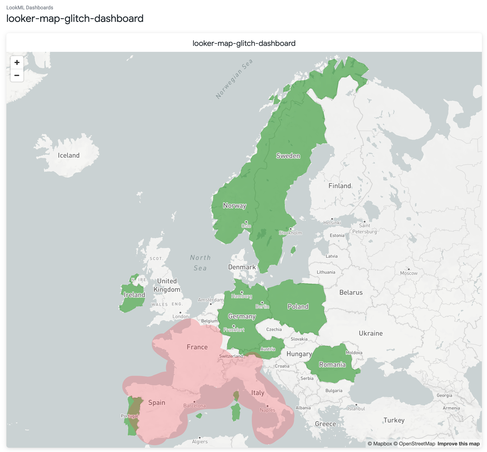
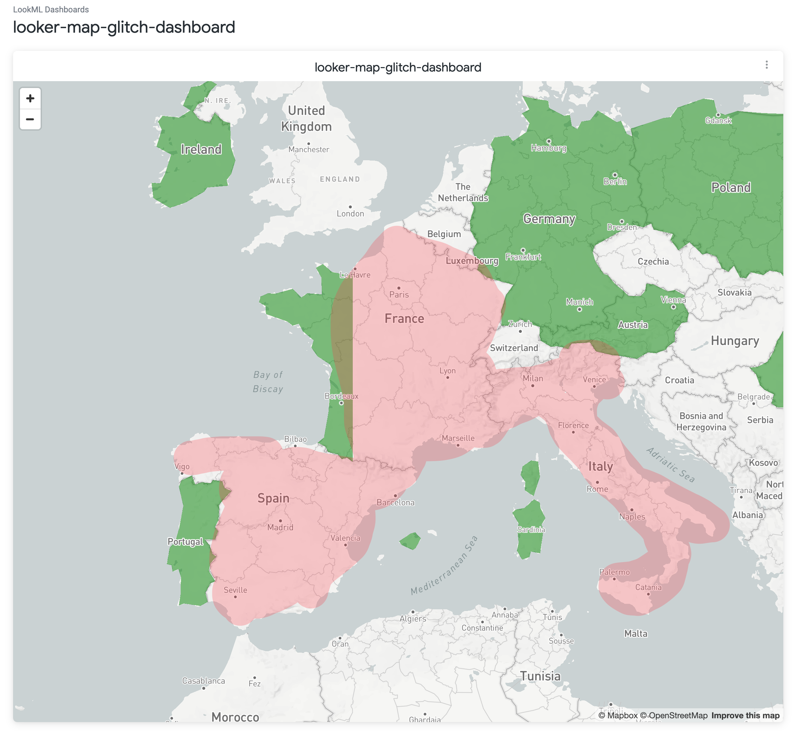
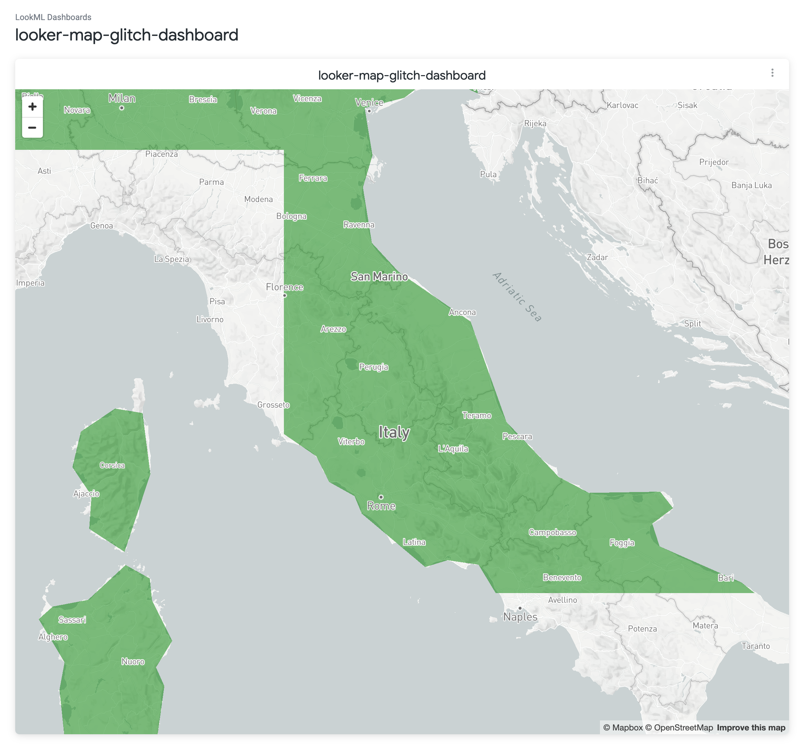
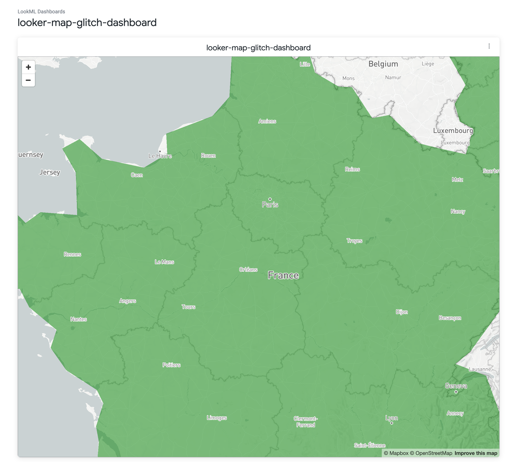

# looker-broken-custom-map-visualisation
LookML project for reproducing the visualisation problem with custom topojson maps

## Project

Project structure

## The problem

Some country "fill" is not visible until zoomed in. In the example dashboard / explore provided in the project file, these countries are

- Spain
- France
- Italy

